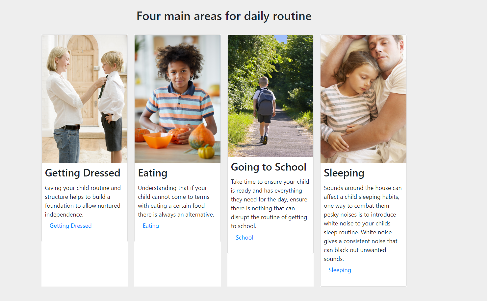
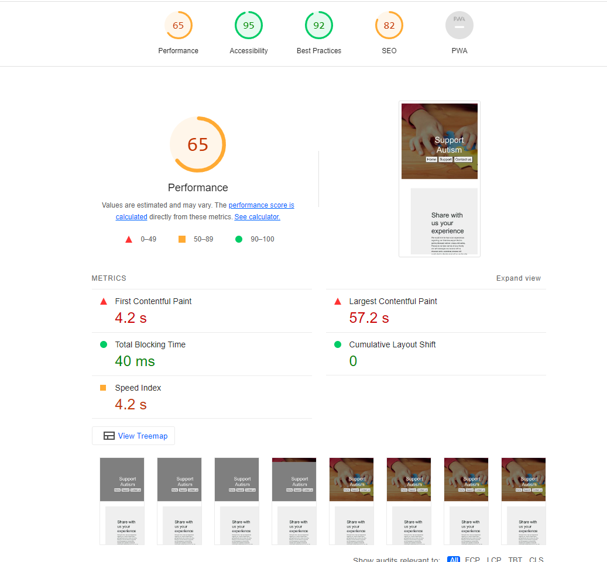

# Support Autism

[View here for Support Autism](https://nick8735.github.io/Autism-Project/)

Support Autism is a charitable website dedicated to providing assistance and resources for individuals facing the unique challenges of raising a child with autism. The website's "Real Life Experiences" section offers an invaluable platform for parents and caregivers to share their personal stories, highlighting both the obstacles they've encountered and the triumphs they've achieved. By featuring a diverse range of narratives in each of the four covered domains, readers gain access to multiple perspectives, ensuring a well-rounded understanding of the subject matter.

I selected this topic for my project because I noticed a significant gap in genuine support for parents dealing with autism. Existing autism support websites often overlook the true challenges and instead prioritize providing resources based on case studies, neglecting the valuable insights from parents and caregivers worldwide. Effective communication and collaboration among parents are essential for making informed decisions regarding our children's daily needs. I strongly believe that by sharing these stories and experiences, we can not only gather valuable support ideas but also encourage more open dialogue and inquiries, fostering continuous learning and support for our children with autism.

# Project Goals

Mission: Our aim is to establish a comprehensive platform that provides users with explicit support, offering key insights and ideas to assist them on their journey. We strive to create a space where parents can access the experiences and knowledge of other parents, enabling them to gain valuable wisdom and guidance.

# User Experience (UX)

##  <b>User Stories</b>

### First Time Visitor Goals

1.  As a First time visitor, I want to identify the specific areas of support that relate to my needs.
2.  As a First time visitor I want to explore narratives of individuals who have experienced Autism. This can potentially assist me in acquiring knowledge and adapting to new strategies that can enhance my children's daily routines.
3. As a First-time visitor,  I want to navigate the website easily and locate the information I am seeking.

### Returning Visitor Goals

1. As a Returning Visitor, I want to read about new strategies and visual tools that could help my children.
2. As a Returning Visitor, I want to have an opportunity to share my experiences and provide guidance and advice that have been shared with me as well.
3. As a Returning Visitor, I want to find fresh new experiences updated consistently.

### Frequent Visitors Goals

1. As a Frequent User, I want to find links to sicial media sites to delve further into more information about Autism.
2. As a Frequent User, I want to see new updated learning supports and new ideas.
3. As a Frequent User, I want to post a quick message about an experience that had just happened befroe I go to work.

# Design

### Colour Scheme

1. Three main colours used are white, grey and purple.

### Imagery

1. All images were selected from [Shutterstock](https://www.shutterstock.com). The Banner images were selected due to the bright colours and relating to Autism.

### Project design plan

Throughout the development process, my project underwent numerous transformations. Discovering the optimal design and flow for the website proved to be a challenge. As I progressed with the initial design, it became increasingly evident that the user experience lacked value and convenience.

 
 

## How will I approach the design phase in the future?

 

* Prioritizing user experience is crucial, and an excessive number of pages can hinder users in finding their desired information.

* I intend to allocate more time to market research, as I found that drawing inspiration from other Autism charity websites greatly assisted me in selecting the appropriate design.

*  I will exercise greater caution when choosing imagery and ensure that I have a diverse range of backup images available in case any resolution issues arise later on.

* I will dedicate more consideration to how the code aligns with the design and its functionality, ensuring a cohesive and seamless integration. 

# Features

* Hero image - Bright and colourful to attact user to venture deeper.

* Nav-Bar simple and eay to use.

* Interactive elements, cards on the home page have links that will take you to the specific sections to aide user travel.

* User return appeal. The website incorporates real-life experiences shared by users through the contact page, with each section showcasing a unique message. This approach ensures consistent updates and provides users with a compelling reason to revisit the site.

*The contact page on the website aligns with the site's theme and offers users the opportunity to actively participate by sharing their stories and experiences in supporting a child with Autism.

 *Thank you page stays with the theme of the site and thanks the user for sharing a story or experience.

 

 * Website responsive on all device sizes.

# Technologies Used

## Languages Used

* HTML5
* CSS3

## Frameworks, Libraries & Programs Used

1. Bootstrap 4.4.1
* Bootstrap was used to support only with the Nav Bar and Footer.
2. Git
* Git was used for version control by utilizing the Gitpod terminal to commit to Git and Push to GitHub. - In the future, I will exercise more discretion in utilizing commits and focus on providing more detailed commits that highlight significant code milestones.
3. GitHub
* Github was used to store project coding after being pushed.
4. Figma 
*  Figma was used to support with design and planning.
5. Shutterstock 
* Shutterstock was used to format images. 

# Testing

The W3C Markup Validator was used to validate every page of HTML code.

* Most errors were found on the support page as the examples shown below.

Main error was the use of the anchor as a descendant of the button element.

I found the answer on [Stack overflow](https://stackoverflow.com/questions/24837102/the-element-button-must-not-appear-as-a-descendant-of-the-a-element) which is a open forum for coding support.

Other errors were a range of unclosed divs.

### CSS

* The following shows CSS errors found at W3C Validator: 

Errors were for not using the correct values for 3 CSS elements. 

## Further Testing

* The Website was tested to ensure all interactive areas worked and operated as designed.
* Friends and family were asked to review the website to check for any bugs.
* Each page was validated through google lighthouse.

* Home Page

* Support page

* Contact page

## Known Bugs

# Deployment

## GitHub Pages

The project was deployed to GitHub Pages using the following steps...

1. Log in to GitHub and locate the GitHub Repository
2. At the top of the Repository (not top of page), locate the "Settings" Button on the menu. Alternatively Click Here for a GIF demonstrating the process starting from Step 2.
3. Scroll down the Settings page until you locate the "GitHub Pages" Section.
4. Under "Source", click the dropdown called "None" and select "Master Branch".
5. The page will automatically refresh.
6. Scroll back down through the page to locate the now published site link in the "GitHub Pages" section.

## Forking the GitHub Repository

By forking the GitHub Repository we make a copy of the original repository on our GitHub account to view and/or make changes without affecting the original repository by using the following steps...

1. Log in to GitHub and locate the GitHub Repository
2. At the top of the Repository (not top of page) just above the "Settings" Button on the menu, locate the "Fork" Button.
3. You should now have a copy of the original repository in your GitHub account.

## Making a Local Clone

1. Log in to GitHub and locate the GitHub Repository
2. Under the repository name, click "Clone or download".
3. To clone the repository using HTTPS, under "Clone with HTTPS", copy the link.
4. Open Git Bash
5. Change the current working directory to the location where you want the cloned directory to be made.
6. Type git clone, and then paste the URL you cpoied in step 3

$ git clone https://github.com/Nick8735/Autism-Project

Press Enter. Your local clone will be created.

$ git clone https://github.com/Nick8735/Autism-Project

* Cloning into `CI-Clone`...
* remote: Counting objects: 10, done.
* remote: Compressing objects: 100% (8/8), done.
* remove: Total 10 (delta 1), reused 10 (delta 1)
* Unpacking objects: 100% (10/10), done.

# Credits

`python3 -m http.server`

